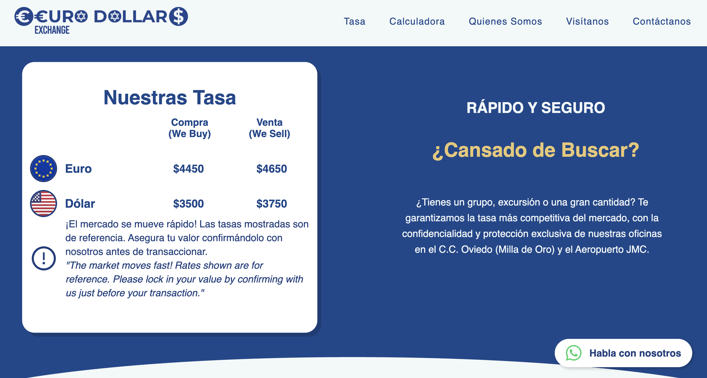

# Euro Dollar Colombia 💱

Currency exchange website for a Medellín-based business with 
16 years in the market, with locations at C.C. Oviedo and 
Aeropuerto José María Córdova.

## 🔗 Live Site
[eurodollarcolombia.com](https://www.eurodollarcolombia.com)

## 🛠️ Built With
- Next.js
- React
- SCSS Modules
- Google Sheets API

## ✨ Features
- Live exchange rates updated dynamically from Google Sheets
- Multi-currency calculator (EUR, USD, COP and more)
- Fully responsive design
- SEO optimized with structured data
- WhatsApp contact integration
- Facebook Pixel integration
- Bilingual content (Spanish / English)

## 📬 How the rates work
The business owner updates exchange rates directly in a 
Google Sheets spreadsheet. The site reads the sheet via 
the Google Sheets API and displays the current rates 
in real time — no backend or CMS required.

## 📸 Preview

